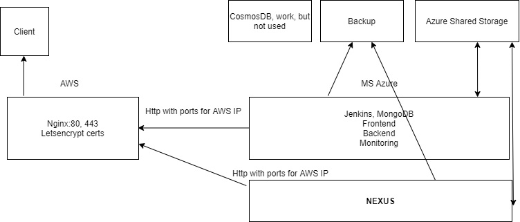

# DevOps&JS&C# Internship Project
## CI/CD 

### Project uses AWS cloud and Microsoft Azure cloud
##### Project structure
- Frontend - Angular
- Backend - C#
- BD - Mongodb
## Features
### Tools used
- Ansible for instance configuration 
- Jenkins for CI/CD
- Docker. Each app component is containered in Docker 
- GitHub integration
- Nexus private artifact storage
- Monitoring with Prometheus and Graphana
- AWS and Azure virtual instances, BD, storage, private net, backup and other services

## Project homepage 
### [Offer Place For Exadel](https://offerplaceforexadel.radiolacattor.ru/)
- login "user"
- password "1234"

### Source code [Frontend](https://github.com/ala-n/internship2021_ui) [Backend](https://github.com/ala-n/internship2021)

